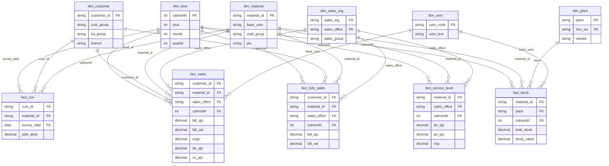

# Tempo Datamart Plan (PoC)

**Prinsip:** Pakai data yang ada saja. Tidak request master data tambahan di fase ini.
**Periode:** Oktober - Desember 2024
**Target engine:** DuckDB / Parquet (local PoC), bisa naik ke Trino/Impala nanti

---

## 1. Scope: Data yang Dipakai

Hanya 21 file di `datasets/MTPL/`. Tidak ada enrichment dari sumber luar.

| Domain | File | Dipakai untuk |
|--------|------|---------------|
| Sales | 6 TXT | `fact_sales` + sebagian dim |
| B2B | 3 TXT | `fact_b2b_sales` + enrich `dim_customer`, `dim_material` |
| Stock | 3 TXT | `fact_stock` + `dim_plant` |
| Service Level | 1 TXT | `fact_service_level` |
| SAT OOS | 1 XLSX | `fact_oos` |
| SAT Promo | 1 XLSX | **Out of scope fase 1** (cuma Des 2024) |
| Picking / Unloading | 2 XLSX | **Out of scope fase 1** (bisa fase 2) |
| Stock SAT-IDM | 1 XLSB | **Out of scope fase 1** (belum di-inspect) |
| Base UOM | 1 XLSX | `dim_uom` |
| Custom Key Figure | 1 XLSX | `dim_key_figure` (partial) |
| Catatan Data | 1 XLSX | Referensi transformasi, bukan tabel |

**Yang sengaja tidak dipakai di fase ini:**
- Nama customer (tidak ada di data, kolom `Customer` = duplikat ID)
- Nama material / plant (tidak ada, cuma kode)
- Master hierarchy lengkap (tidak ada file terpisah)

---

## 2. Fact & Dimension Tables (dari data existing saja)

### 2.1 Fact Tables

#### `fact_sales`
**Source:** 6 file Sales TXT
**Grain:** 1 baris = customer + material + sales_office + calmonth (+ bill_type, doc_type, route, subhub)

| Kolom | Source SAP | Tipe | Keterangan |
|-------|-----------|------|------------|
| `bill_type` | 0BILL_TYPE | FK/dim | Tipe billing doc |
| `calmonth` | 0CALMONTH | FK → dim_time | Bulan (YYYYMM) |
| `calday` | 0CALDAY | FK → dim_time | Hanya file Nov, nullable |
| `customer_id` | 0CUSTOMER | FK → dim_customer | |
| `cust_group` | 0CUST_GRP3 | attr | Redundant ke dim, keep for query speed |
| `material_id` | 0MATERIAL | FK → dim_material | |
| `matl_group` | ...MATLGRP | attr | 3 char, partial |
| `sales_org` | 0SALESORG | FK → dim_sales_org | |
| `sales_office` | 0SALES_OFF | FK → dim_sales_org | |
| `sales_group` | 0SALES_GRP | FK → dim_sales_org | |
| `sold_to` | 0SOLD_TO | attr | |
| `doc_type` | 0DOC_TYPE | attr | |
| `route` | Route List | attr | |
| `subhub` | ZSUBHUB | attr | |
| `base_uom` | 0BASE_UOM | FK → dim_uom | |
| `currency` | Currency | attr | |
| `bill_qty` | 0BILL_QTY | measure | |
| `bill_val` | BILL_VAL | measure | Revenue utama |
| `cn_amt` | CN_AMT | measure | Credit note amount |
| `cn_qty` | CN_QTY | measure | Credit note qty |
| `do_amt` | DO_AMT / DO Amount | measure | Rename di Dec 16-31 |
| `do_qty` | DO_QTY | measure | |
| `net_sales` | VV802 / Net Sales | measure | Rename di Dec 16-31 |
| `cogs` | ZCOST | measure | COGS |
| `disc_*` | DIS_A..DIS_VOL2 | measure | 22 kolom diskon, keep as columns |
| `ziokf0028`..`0033` | ZIOKF0028..0033 | measure | Custom figures, **÷ 100** |

---

#### `fact_b2b_sales`
**Source:** 3 file B2B TXT
**Grain:** customer + material + sales_office + calmonth

| Kolom | Source | Tipe |
|-------|--------|------|
| `calmonth` | 0CALMONTH | FK → dim_time |
| `customer_id` | 0CUSTOMER | FK → dim_customer |
| `material_id` | 0MATERIAL | FK → dim_material |
| `sales_office` | 0SALES_OFF | FK → dim_sales_org |
| `branch` | BRANCH | attr |
| `ka_group` | KA Group | attr |
| `plu` | Kode PLU | attr |
| `base_uom` | 0BASE_UOM | FK → dim_uom |
| `currency` | Currency | attr |
| `bill_qty` | 0BILL_QTY | measure |
| `bill_val` | BILL_VAL | measure |

---

#### `fact_stock`
**Source:** 3 file Stock TXT
**Grain:** material + plant + stor_loc + calmonth

| Kolom | Source | Tipe |
|-------|--------|------|
| `material_id` | 0MATERIAL | FK → dim_material |
| `plant` | Plant | FK → dim_plant |
| `product` | 0PRODUCT | attr |
| `stock_cat` | 0STOCKCAT | attr |
| `stock_type` | 0STOCKTYPE | attr |
| `stor_loc` | 0STOR_LOC | FK → dim_plant |
| `vendor` | Vendor / 0VENDOR | attr |
| `calmonth` | 0CALMONTH | FK → dim_time |
| `upd_date` | 0UPD_DATE | attr |
| `base_uom` | 0BASE_UOM | FK → dim_uom |
| `consignment_stock` | ...CNSSTCK | measure |
| `total_stock` | ...TOTSTCK | measure |
| `stock_value` | ...VALSTCK | measure |

---

#### `fact_service_level`
**Source:** Service Level TXT
**Grain:** material + sales_office + cust_group + calmonth

| Kolom | Source | Tipe |
|-------|--------|------|
| `material_id` | 0MATERIAL | FK → dim_material |
| `sales_org` | 0SALESORG | FK → dim_sales_org |
| `sales_office` | 0SALES_OFF | FK → dim_sales_org |
| `cust_group` | 0CUST_GRP3 | attr |
| `calmonth` | 0CALMONTH | FK → dim_time |
| `calyear` | 0CALYEAR | attr |
| `base_uom` | 0BASE_UOM | FK → dim_uom |
| `do_amt` | DO_AMT | measure |
| `do_qty` | DO_QTY | measure |
| `po_amt` | PO_AMT | measure |
| `po_qty` | PO_QTY | measure |
| `nsp` | NSP | measure |
| `lead_time` | Lead = 4 | measure |
| `ziokf0034`..`0069` | ZIOKF0034..0069 | measure |

---

#### `fact_oos`
**Source:** SAT OOS XLSX
**Grain:** survey_date + customer + material

| Kolom | Source | Tipe |
|-------|--------|------|
| `survey_date` | TGL_DCP | FK → dim_time |
| `cust_id` | Cust Id | FK → dim_customer |
| `cust_code` | Cust Code | attr |
| `material_id` | Material_code | FK → dim_material |
| `plu` | PLU | attr |
| `stok_akhir` | Stok_akhir | measure (0 = OOS) |

---

### 2.2 Dimension Tables

Hanya attribute yang benar-benar ada di data. Tidak ditambah kolom dummy.

#### `dim_customer`
**Source:** DISTINCT dari Sales + B2B + SAT OOS

| Kolom | Ada? | Sumber |
|-------|------|--------|
| `customer_id` | Ya | 0CUSTOMER / Cust Id |
| `cust_group` | Ya | 0CUST_GRP3 (dari Sales) |
| `ka_group` | Parsial | KA Group (dari B2B saja, nullable) |
| `branch` | Parsial | BRANCH (dari B2B saja, nullable) |

> Tidak ada `customer_name`. Dashboard/AI akan pakai ID.

---

#### `dim_material`
**Source:** DISTINCT dari Sales + B2B + Stock + SAT

| Kolom | Ada? | Sumber |
|-------|------|--------|
| `material_id` | Ya | 0MATERIAL / Material_code |
| `base_uom` | Ya | 0BASE_UOM |
| `matl_group` | Parsial | ...MATLGRP (3 char, dari Sales) |
| `plu` | Parsial | Kode PLU / PLU (dari B2B + SAT, nullable) |

> Tidak ada `material_name` / `product_category`.

---

#### `dim_sales_org`
**Source:** DISTINCT dari Sales + B2B + Service Level

| Kolom | Ada? | Sumber |
|-------|------|--------|
| `sales_org` | Ya | 0SALESORG |
| `sales_office` | Ya | 0SALES_OFF |
| `sales_group` | Ya | 0SALES_GRP |

> Semua kode numerik/text, tanpa nama cabang.

---

#### `dim_time`
**Source:** Generated

| Kolom | Cara generate |
|-------|---------------|
| `date_key` | YYYYMMDD (dari calday jika ada, else null) |
| `calmonth` | YYYYMM dari 0CALMONTH |
| `year` | Extract dari calmonth |
| `month` | Extract dari calmonth |
| `quarter` | Q1-Q4 dari month |
| `fiscal_period` | Dari 0FISCPER jika perlu join ke Sales |

Range: 202410 - 202412 (+ daily untuk Nov jika pakai calday)

---

#### `dim_plant`
**Source:** DISTINCT dari Stock

| Kolom | Ada? | Sumber |
|-------|------|--------|
| `plant` | Ya | Plant |
| `stor_loc` | Ya | 0STOR_LOC |
| `vendor` | Parsial | Vendor (sering kosong) |

---

#### `dim_uom`
**Source:** Base UOM.XLSX (langsung load)

| Kolom | Ada? |
|-------|------|
| `uom_code` | Ya |
| `uom_text_short` | Ya |
| `uom_text_long` | Ya |

---

#### `dim_key_figure`
**Source:** Custom Key Figure Sales.xlsx (langsung load, 8 records)

| Kolom | Ada? |
|-------|------|
| `key_figure_code` | Ya |
| `description` | Ya |

> Cuma cover Z* figures. Kolom DIS_* tidak punya mapping, tetap sebagai kolom di fact_sales.

---

## 3. ERD Design

### 3.1 Diagram (Star Schema)



### 3.2 Relasi antar Fact (untuk analisis cross-domain)

Tidak ada FK langsung antar fact table. Join via shared dimensions:

```
fact_sales ←→ fact_b2b_sales     ON customer_id + material_id + sales_office + calmonth
fact_sales ←→ fact_stock         ON material_id + calmonth
fact_sales ←→ fact_service_level ON material_id + sales_office + calmonth
fact_sales ←→ fact_oos           ON customer_id + material_id (+ calmonth approx dari survey_date)
fact_stock ←→ fact_oos           ON material_id
```

### 3.3 Grain Summary

| Fact | Grain (1 baris =) | ~Volume |
|------|-------------------|---------|
| fact_sales | customer × material × sales_office × month × doc context | ~3.4M |
| fact_b2b_sales | customer × material × sales_office × month | ~4.9M |
| fact_stock | material × plant × stor_loc × month | ~540K |
| fact_service_level | material × sales_office × cust_group × month | ~224K |
| fact_oos | customer × material × survey_date | ~901K |

---

## 4. Business Case & Koneksi ke AI

### 4.1 Business Case (dari ERD + data existing)

Karena dimension cuma kode (tanpa nama), business case fokus ke **analisis numerik dan perbandingan**, bukan reporting executive yang butuh label cantik.

| # | Business Case | Fact/Dim yang dipakai | Contoh pertanyaan bisnis |
|---|---------------|----------------------|--------------------------|
| BC1 | **Sales Performance** | fact_sales, dim_time, dim_sales_org | Berapa total bill_val per sales_office per bulan? Office mana yang turun Oct→Nov? |
| BC2 | **Margin Analysis** | fact_sales (bill_val, zcost, disc_*) | Berapa gross margin per material? Material mana discount-nya paling besar? |
| BC3 | **B2B vs General Trade** | fact_sales + fact_b2b_sales | Compare volume B2B vs non-B2B per KA group |
| BC4 | **Service Level / Fill Rate** | fact_service_level | DO_QTY / PO_QTY per sales_office = fill rate. Office mana paling jelek? |
| BC5 | **Stock vs Sales Coverage** | fact_stock + fact_sales | Material dengan stock rendah tapi sales tinggi (potential stockout risk) |
| BC6 | **Out of Stock Impact** | fact_oos + fact_sales | Material/customer dengan OOS tinggi, apakah bill_val turun di periode yang sama? |
| BC7 | **Credit Note / Return Analysis** | fact_sales (cn_amt, cn_qty) | Return rate per cust_group atau material |
| BC8 | **Discount Leakage** | fact_sales (disc_*, ziokf*) | Total discount per sales_office, tren bulan ke bulan |

### 4.2 Koneksi ke AI (Cloudera Enterprise AI PoC)

Datamart ini jadi **ground truth** untuk AI layer. Alur:

```
User (natural language)
        ↓
  AI Agent (Cloudera AI / Qwen)
        ↓
  Semantic Layer (YAML) ← definisi metric & dimension
        ↓
  NL-to-SQL / Governed Query
        ↓
  Datamart (Fact + Dim di DuckDB/Trino)
        ↓
  Response (insight + rekomendasi)
```

#### Use Case AI spesifik

| AI Use Case | Input user | AI action | Datamart query |
|-------------|-----------|-----------|----------------|
| **NL Query** | "Sales office 0240 bulan November berapa?" | Parse → SQL | `SUM(bill_val) FROM fact_sales WHERE sales_office='0240' AND calmonth=202411` |
| **Root Cause** | "Kenapa sales turun di office 0240?" | Multi-step: compare periods, check service level, stock, OOS | Join fact_sales + fact_service_level + fact_oos |
| **Anomaly Detection** | (automated) | Flag material/office dengan delta > threshold | Statistical query across fact_sales by calmonth |
| **Cross-domain Insight** | "Material X sering OOS, apakah sales-nya juga turun?" | Correlate fact_oos.stok_akhir=0 dengan fact_sales.bill_qty trend | Join via material_id + time |
| **Margin Alert** | "Material mana margin-nya di bawah average?" | `(bill_val - zcost) / bill_val` per material | fact_sales aggregation |
| **Fill Rate Monitor** | "Office mana fill rate-nya di bawah 80%?" | `do_qty / po_qty` | fact_service_level |

#### Integrasi dengan stack PoC existing

Project sudah punya `projects/tempo_scan/semantic/` dengan definisi sales & inventory (synthetic). Plan migrasi:

| Komponen existing | Mapping ke datamart real |
|-------------------|-------------------------|
| `semantic/sales.yaml` | Map ke `fact_sales` + dims (update column names ke SAP codes) |
| `semantic/inventory.yaml` | Map ke `fact_stock` + `fact_oos` |
| `golden_questions.yaml` | Adapt pertanyaan ke dimensi yang ada (sales_office, material_id, bukan region_name) |
| Agent Studio tools (OSSIE demo) | `execute_governed_query`, `query_ontology` → point ke datamart |

**Contoh golden question yang realistis dengan data existing:**

```
"Berapa total penjualan (bill_val) per sales office di Q4 2024?"
"Sales office mana yang paling banyak credit note?"
"Material dengan stock terendah tapi penjualan tertinggi?"
"Fill rate (DO/PO) per sales office bulan Desember?"
"Customer mana yang paling sering OOS di lapangan?"
"B2B KA group 101 vs general trade, siapa lebih besar volumenya?"
```

#### AI Architecture (PoC)

```
┌─────────────────────────────────────────────┐
│  Chat UI (Tempo Scan Assistant)             │
└──────────────────┬──────────────────────────┘
                   │ natural language
                   ▼
┌─────────────────────────────────────────────┐
│  LLM (Qwen via vLLM / LiteLLM)              │
│  + System prompt + semantic context          │
└──────────────────┬──────────────────────────┘
                   │ tool call
                   ▼
┌─────────────────────────────────────────────┐
│  Semantic Layer                              │
│  - metric definitions (bill_val, fill_rate)  │
│  - dimension aliases (sales_office, material)│
│  - query rules (require date filter, limit)  │
└──────────────────┬──────────────────────────┘
                   │ governed SQL
                   ▼
┌─────────────────────────────────────────────┐
│  Datamart (DuckDB)                           │
│  5 fact + 6 dim tables                       │
└─────────────────────────────────────────────┘
```

**Keuntungan pakai dim/fact terstruktur untuk AI:**
- LLM tidak perlu tahu format SAP TXT / tab-delimited
- Semantic layer batasi field yang boleh di-query (governance)
- Metric definition konsisten (bill_val vs net_sales vs do_amt)
- Agent bisa multi-hop: sales → service level → OOS dalam satu reasoning chain

---

## 5. Implementation Plan

| Step | Task | Output | Estimasi |
|------|------|--------|----------|
| 1 | Ingestion script: SAP TXT → Parquet | `scripts/ingest_tempo.py` | 1-2 hari |
| 2 | Build dim tables (dedup + generate time) | 6 dim tables di DuckDB | 0.5 hari |
| 3 | Build fact tables (clean + normalize cols) | 5 fact tables di DuckDB | 1 hari |
| 4 | Data quality check (nulls, grain, row counts) | QA report | 0.5 hari |
| 5 | Update semantic layer YAML | `projects/tempo_scan/semantic/` | 1 hari |
| 6 | Golden questions (realistic) | Updated YAML | 0.5 hari |
| 7 | Test NL-to-SQL end to end | Test results | 1 hari |

**Transform rules wajib:**
- Skip 3 header rows (SAP export)
- Key figures ZIOKF* ÷ 100
- Normalize Dec column rename (DO Amount → do_amt, Net Sales → net_sales)
- TGL_DCP Excel serial → proper date

---

## 6. Konfirmasi ke Tempo

List lengkap ada di `TEMPO_DATA_UNDERSTANDING.md` Section 7. Prioritas tinggi:

| # | Pertanyaan | Kenapa penting |
|---|-----------|----------------|
| 1 | Scope 5 fact table sudah benar? | Validasi ERD |
| 2 | BILL_VAL vs Net Sales vs DO Amount — mana official revenue? | Metric definition AI |
| 3 | Formula resmi gross margin & fill rate? | Metric definition AI |
| 4 | B2B overlap dengan Sales? Boleh double-count? | Avoid wrong revenue |
| 5 | Key figure ÷ 100 — confirm? Kolom mana saja? | Data accuracy (discount, COGS) |
| 6 | Catatan terkait Data.xlsx: "jan-mar 2026–2034" maksudnya apa? | Dokumentasi anomali, apply rule ke Okt–Des 2024? |
| 7 | MATLGRP "Mar 2026" di catatan — typo atau fiscal SAP? | Transform material group |
| 8 | Composite key sales_org+office & plant+stor_loc unique? | Silent wrong join |
| 9 | OOS harian OK di-agg ke bulanan untuk join sales? | Cross-fact grain alignment |
| 10 | cust_group ↔ customer mapping untuk join service level? | Cross-fact grain alignment |
| 11 | Master data (nama customer/material/plant) tersedia? | Dim enrichment fase 2 |
| 12 | Kolom di-mask (`...E_STORE`, dll.) — versi lengkap? | Completeness |

---

## 7. Risks & Mitigasi

| Risk | Impact | Mitigasi |
|------|--------|----------|
| Dimension cuma kode, dashboard kurang readable | UX | PoC fokus AI chat, bukan dashboard visual. Label ditambah di fase 2 |
| B2B vs Sales overlap | Double count | Flag channel di fact, atau pisah analysis |
| Kolom inconsistent (Nov calday, Dec rename) | ETL complexity | Normalization layer di ingestion |
| Key figure × 100 | Wrong numbers | Apply transform + document di semantic layer |
| No material/customer name | Limited NL query | AI query by ID/code, atau top-N list |

---

## 8. Gold View Baru (fase lanjutan, 24 Sep 2026)

Setelah katalog 165 pertanyaan (`TEMPO_BUSINESS_QUESTIONS_CATALOG.md`) selesai dianotasi dan semua item `clarify` diresolusi, teridentifikasi **9 Gold view baru** yang dibutuhkan untuk menaikkan status pertanyaan dari `needs_semantic_v2` ke `governed_v1`. Semua sumbernya sudah ada di layer silver (lihat skema di bawah), jadi tidak perlu data baru — hanya perlu agregasi/view baru di Gold.

**Temuan penting:** semua 9 view ini bisa dibangun sebagai agregasi langsung dari **satu tabel silver saja** (tidak ada yang butuh join lintas tabel di level silver). Draft semantic model Irvan (`datasets/dari irvan/TEMPO_semantic_model.ossie.yaml`) sudah punya nama dataset yang cocok untuk 3 dari 9 (B2B PLU, Stock SAT-IDM, SAT OOS), tapi definisinya masih menunjuk ke `silver.*` (placeholder), belum jadi view Gold fisik.

| # | Gold view (usulan) | Domain | Source silver | Cakupan katalog | Di draft Irvan? | Di rencana fase-1 (§1)? |
|---|---|---|---|---|---|---|
| 1 | `gold.corr_b2b_branch_estore_month` | B2B | `b2b_oct_dec_2024` | B02, B05 | Parsial (`b2b_line`, masih silver) | Tidak |
| 2 | `gold.corr_b2b_material_plu` | B2B | `b2b_oct_dec_2024` | B07, PQ2 | Ya (`b2b_material_plu`) | Tidak |
| 3 | `gold.rpt_sat_idm_*` | Stock SAT-IDM | `stock_sat_idm_monthly_okt_des_24` | I01-I15 | Ya (`sat_idm_plu_month`) | Tidak ("out of scope fase 1") |
| 4 | `gold.rpt_sat_oos_*` | SAT OOS | `sat_oos_okt_des_2024` | O01-O15 | Ya (`sat_retail_material_month`) | Parsial (fase 1, tapi belum ada rollup bulanan) |
| 5 | `gold.corr_stock_tempo_month_seta` | Stock Tempo | `stock_tempo_oct_dec_2024` | T01, T05, T09 (Set A saja, lihat §6) | Tidak ada yang persis | Tidak |
| 6 | `gold.rpt_service_level_office_custgrp3` | Service Level | `service_level_oct_dec_2024` | L01-L15 (minus L06/L07/L08/L09 — lihat §6) | Tidak | Tidak |
| 7 | `gold.rpt_unloading_document` | Unloading | `unloading_okt_des_24` | U01-U15 | Tidak | Tidak ("out of scope fase 1") |
| 8 | `gold.rpt_picking_delivery_line` | Picking | `picking_okt_des_24` | K01-K15 (minus K06/K07/K14 — lihat §6) | Tidak | Tidak ("out of scope fase 1") |
| 9 | `gold.rpt_sat_promo_*` | SAT Promo | `sat_promo_des_24` | P01-P15 (minus P02/P10 — lihat §6) | Tidak | Tidak ("out of scope fase 1") |

**Catatan grain per view:**
- View #1/#2 (B2B): `branch`, `e_store`, `kode_plu`, `ka_group` semua di level baris `b2b_oct_dec_2024` — tinggal `GROUP BY`, sesuai keputusan PoC bahwa sales_off/branch/PLU/material adalah dimensi independen (lihat §6 catatan B2B).
- View #5 (Stock Tempo): hanya pakai Set A (`totstck`, `valstck`, `cnsstck` — tanpa suffix `_1`) sebagai default PoC sementara; Set B diabaikan sampai ada konfirmasi resmi Tempo.
- View #6 (Service Level): exclude `lead_4`, `nsp`, semua `ziokf0034`-`ziokf0069` (di luar scope PoC); grain `sales_office` + `cust_grp3` + `material` + `calmonth`. Kalau `sales_office` dan `cust_grp3` tidak bisa satu grain yang sama secara bersih, kemungkinan perlu dipecah jadi 2 view.
- View #8 (Picking): exclude `cycle` dan `lp` (mayoritas NULL/tidak terdefinisi); grain `sales_office` + `delivery_no`.
- View #9 (SAT Promo): sumber `sat_promo_des_24` **hanya Desember 2024** (tidak ada Okt/Nov) — beda dari 8 view lain yang bisa rollup Q4 penuh, view ini inherently single-month. Perlu ditempel ke data Sales/B2B Desember saja untuk analisis promo vs non-promo (lihat catatan §6 SAT Promo soal field `Mekanisme`).

**Update prioritas (24 Sep 2026):** dari cross-check manual 111 baris `needs_semantic_v2` di katalog vs 9 view di atas, hanya **~43 dari 111** yang benar-benar ter-unblock murni oleh agregasi single-table — sisanya butuh view gabungan lintas domain. Daripada bikin 9 view tersebar tipis, scope dipersempit ke **journey pasar** yang saling menyambung secara naratif (bukan cuma domain acak) — lihat §8.1.

---

## 8.1 Scope Journey (keputusan 24 Sep 2026)

**Prinsip:** fokus ke domain yang membentuk satu alur cerita bisnis utuh — dari stok gudang Tempo sampai ke rak toko — supaya AI bisa jawab pertanyaan preskriptif ("kenapa X terjadi") dengan bukti dari domain sebelah, bukan cuma angka lepas per domain.

```
Stock Tempo (gudang)  →  Sales (Sell-In)  →  B2B (Sell-Out ke DC)  →  Stock SAT-IDM (stok DC/store)  →  SAT OOS (rak toko)
```

**5 domain in-scope:** Stock Tempo, Sales, B2B, Stock SAT-IDM, SAT OOS.
**Ditunda (bukan dihapus):** Service Level, Unloading, Picking (operasional internal, bukan bagian journey pasar), SAT Promo (data cuma Desember, jadi lapisan tambahan di atas journey inti, bukan fondasi).

### Fase A — 5 view per-domain (fondasi journey)

Draft SQL: `datasets/audit/19_gold_b2b_branch_estore_plu_draft.sql` (view 1-2), `datasets/audit/20_gold_journey_fase_a_draft.sql` (view 3-5).

| # | View | Domain | Source silver | Cakupan katalog |
|---|---|---|---|---|
| 1 | `gold.corr_b2b_branch_estore_month` | B2B | `b2b_oct_dec_2024` | B02, B05, B08 |
| 2 | `gold.corr_b2b_material_plu` | B2B | `b2b_oct_dec_2024` | B07, PQ2 |
| 3 | `gold.corr_stock_tempo_month_seta` | Stock Tempo | `stock_tempo_oct_dec_2024` | T01, T05, T09 (Set A saja) |
| 4 | `gold.rpt_sat_idm_dc_month` | Stock SAT-IDM | `stock_sat_idm_monthly_okt_des_24` | I01-I05, I07, I08, I10 |
| 5 | `gold.rpt_sat_oos_material_month` | SAT OOS | `sat_oos_okt_des_2024` | O01-O05 |

Sales tidak perlu view baru di Fase A — mayoritas sudah `governed_v1` di catalog 28-metric lama (`material_sell_in_value`, `gross_billing_value`, dst).

### Fase B — 4 view gabungan (setelah Fase A tervalidasi)

Ini yang bikin journey benar-benar "nyambung" — pertanyaan preskriptif lintas domain baru bisa `governed_v1` kalau view gabungan ini ada (OSSIE melarang runtime-invented join).

| # | View gabungan | Menyambungkan | Join key | Menjawab pertanyaan |
|---|---|---|---|---|
| A | `gold.corr_stock_tempo_sales_material_month` | Stock Tempo ↔ Sales | material + calmonth (sama-sama sudah governed di grain ini) | T07: stok tinggi tapi sell-in rendah = macet |
| B | `gold.corr_sales_b2b_material_month` | Sales ↔ B2B | material + calmonth | Perkuat B06 (gap replenishment Sell-In vs Sell-Out) |
| C | `gold.corr_b2b_satidm_branch_month` | B2B ↔ Stock SAT-IDM | `branch` = `dcname` (**confirmed 26 match**, lihat TEMPO_KAMUS_DATA_AI.md §4) | I06, I11, B11, B12, B13 — replenishment DC sehat/tidak |
| D | `gold.corr_satidm_oos_material_month` | Stock SAT-IDM ↔ SAT OOS | material/PLU | I05, O10 — stok DC ada tapi OOS di rak = masalah distribusi DC→store |

View C prioritas tertinggi di Fase B — join key-nya sudah dikonfirmasi valid dari data (bukan asumsi), jadi risiko rendah dan langsung meng-unblock cluster pertanyaan preskriptif paling penting di journey ini.

**Status: SELESAI dibangun & tervalidasi di Impala (24 Sep 2026).** Semua 9 view (5 Fase A + 4 Fase B) sudah ter-create dan dicek row count + match rate join.

| View | Row count | Match rate join |
|---|---|---|
| `gold.corr_b2b_branch_estore_month` | 60,116 | — |
| `gold.corr_b2b_material_plu` | 420 | — |
| `gold.corr_stock_tempo_month_seta` | 160,355 | — |
| `gold.rpt_sat_idm_dc_month` | 11,458 | — |
| `gold.rpt_sat_oos_material_month` | 768,468 | — |
| `gold.corr_stock_tempo_sales_material_month` (A) | 160,355 | — |
| `gold.corr_sales_b2b_material_month` (B) | 50,730 | — |
| `gold.corr_b2b_satidm_branch_month` (C) | 108 | **100%** (setelah fix, lihat catatan bug di bawah) |
| `gold.corr_satidm_oos_material_month` (D) | 11,458 | **79.6%** |

**Bug ditemukan & diperbaiki selama validasi:**
1. Nama kolom di `gold.rpt_sap_material_month_semantic` (View A/B): draft awal pakai nama metric OSSIE (`material_sell_in_value`) yang salah — kolom fisik yang benar adalah `sell_in_bill_val`/`sell_in_bill_qty` (dikonfirmasi dari `tempo_core.ossie.yaml`, expression `SUM(material_360.sell_in_bill_val)`).
2. Ambiguitas alias subquery di Impala (View B): `GROUP BY calmonth, material` tanpa alias tabel eksplisit gagal di-resolve saat subquery punya nama kolom sama dengan outer query — fix dengan alias tabel eksplisit (`p.calmonth`, `p.material`).
3. `gold.corr_b2b_material_plu` sempat ter-deploy sebagai versi lama/parsial (cuma 2 kolom: `material`, `kode_plu`) — fix dengan `DROP VIEW` + `CREATE VIEW` ulang pakai definisi lengkap.
4. Format `bln` di `silver.stock_sat_idm_monthly_okt_des_24` dikonfirmasi `'OCT'/'NOV'/'DEC'` (bukan angka) — View C/D disesuaikan pakai `CASE` mapping.
5. **Bug paling signifikan (View C, match rate 0% → 100%):** `b2b.branch` punya prefix `"DC "` (mis. `DC BALARAJA`) sedangkan `idm.dcname` tidak (`BALARAJA`) — walau secara bisnis itu DC yang sama (confirmed dari investigasi manual sebelumnya), literal string-nya tidak pernah sama sehingga join awal gagal total. Fix: `UPPER(TRIM(REGEXP_REPLACE(branch, '^DC ', '')))` di sisi kiri sebelum dibandingkan.

Definisi final ada di `datasets/audit/19_gold_b2b_branch_estore_plu_draft.sql`, `20_gold_journey_fase_a_draft.sql`, `21_gold_journey_fase_b_draft.sql` (nama file masih "draft" tapi isinya sudah versi final yang ter-deploy).

---

*Plan ini based on data existing di `datasets/MTPL/` per Sep 2026. Companion docs: `TEMPO_DATA_UNDERSTANDING.md`, `TEMPO_FILE_MAPPING.md`*

## 9. Showcase semantic expansion (28 Sep 2026)

Gold dan OSSIE tetap menjadi kontrak runtime utama. Berdasarkan konfirmasi meeting Tempo dan view yang sudah tersedia, ekspansi showcase memublikasikan metric berikut tanpa membuat runtime join baru:

| Area | Metric governed | Aturan bisnis |
|---|---|---|
| Sales Material | `material_sell_in_quantity`, `material_sell_in_value`, `material_delivery_order_quantity`, `material_delivery_order_amount` | `BILL_QTY/BILL_VAL` adalah billing; `DO_QTY/DO_AMT` adalah Delivery Order. DO amount bukan official Gross Billing Value. |
| B2B Branch/Office | `b2b_branch_sell_out_value`, `b2b_branch_sell_out_quantity` | `branch` (partner/B2B) dan `sales_off` (sales office Tempo) adalah dimensi berbeda pada metric yang sama. |
| B2B Product | `b2b_material_plu_value`, `b2b_material_plu_quantity` | `material` dan `kode_plu` tetap dimensi independen sampai ada master mapping resmi. |
| Stock SAT-IDM | `sat_idm_dc_stock_quantity`, `sat_idm_dc_stock_value`, `sat_idm_store_stock_quantity`, `sat_idm_store_stock_value` | DC dan store/customer merupakan level analisis berbeda; dilarang menjumlahkan, membuat rasio, atau menamai hasilnya “total pipeline”. |
| Service Level | `service_unfulfilled_quantity` | Selalu hitung `SUM(PO_QTY) - SUM(DO_QTY)`, bukan rata-rata gap baris atau persen. |
| Picking/Unloading | `picking_workload_rows`, `unloading_event_count` | Count workload/event row, bukan quantity barang atau jumlah dokumen unik. |

Untuk showcase 29 Sep 2026, Neo4j, Qdrant, dan Semantica tidak ditambahkan ke runtime. Definisi Irvan hanya dipakai sebagai kandidat offline yang harus lolos pemeriksaan source view, grain, formula, unit, dan status approval sebelum masuk OSSIE.
