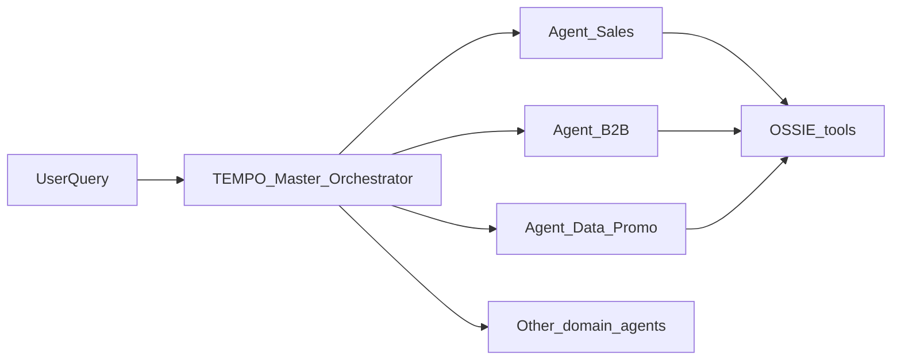

# Agent Studio — Master Orchestration Workflow

## Prerequisites

- CAI project with `projects/tempo_scan_impala` uploaded (read-only mount).
- Five OSSIE tools registered from [../agent_studio_tools/](../agent_studio_tools/).
- Model group for SCAN / commercial intelligence.

## Workflow type

Use **Agent Studio Workflow** (orchestrator pattern):

## Step-by-step setup

### 1. Create sub-agents (×9)

For each row in [README.md](README.md):

1. New Agent in Agent Studio.
2. Paste system instruction from matching `agent_*.md` + append contents of `_shared_agent_rules.md`.
3. Attach all five tools (same tool instances).

### 2. Create Master Orchestrator

1. New Agent: `TEMPO Master Orchestrator`.
2. Paste [master_orchestrator.md](master_orchestrator.md).
3. **Do not** attach SQL tools to Master (routing only), OR attach read-only `query_ontology` for capability discovery.

### 3. Wire workflow

| Node | Type | Config |
|------|------|--------|
| Start | Input | User message |
| Route | LLM Task | Master prompt; output JSON delegation |
| Branch | Conditional | `primary_agent` → sub-agent task |
| SalesTask | Agent call | TEMPO Agent Sales |
| Merge | LLM Task | Combine sub-agent outputs + chart_spec |
| End | Output | Final narrative |

For **multi-domain** (e.g. O11): sequential tasks Sales → SAT OOS → Merge (max 3).

### 4. Acceptance

Run prompts from [E2E_PILOT_CHECKLIST.md](E2E_PILOT_CHECKLIST.md).

### 5. Legacy single agent

Keep `TEMPO Governed Analytics Agent` ([AGENT_STUDIO_SETUP.md](../agent_studio_tools/AGENT_STUDIO_SETUP.md)) for regression until orchestrator passes pilot.

## Integration tools (later)

Chart renderer consumes `chart_spec` from agent text; not required for F2 gate.
